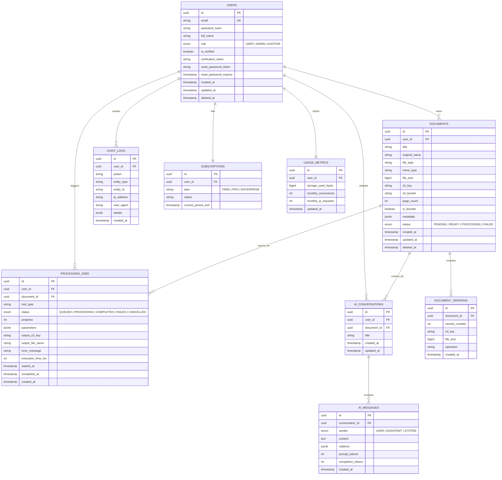

# CloudDoc AI - System Architecture & Engineering Blueprint

> **Platform:** AI-Powered Cloud Document Processing & Conversion SaaS  
> **Classification:** Production-Grade Enterprise SaaS Architecture  
> **Target Cloud Environment:** Amazon Web Services (AWS)  
> **Authors:** Principal UI/UX Designer, Senior Frontend Architect, Staff Backend Engineer, Cloud Engineering Lead  

---

## 1. System Architecture Overview

CloudDoc AI is a multi-tier, event-driven SaaS platform built for high-throughput, secure document transformation, optical character recognition (OCR), and retrieval-augmented generation (RAG) AI processing. 

### High-Level Architecture Diagram

```
                        [ Users & Client Browsers ]
                                     │
                                     ▼ (HTTPS / TLS 1.3)
                           [ AWS Route 53 DNS ]
                                     │
                                     ▼
                     [ AWS Application Load Balancer ]
                        (SSL Termination & WAF)
                         │                   │
            (Static Assets / SPA)       (REST API: /api/v1/*)
                         │                   │
                         ▼                   ▼
                 [ AWS CloudFront ]    [ Ubuntu EC2 Instances ]
                         │              (Node.js + Express API)
                         ▼               [ PM2 Process Manager ]
                  [ S3 Web Host ]            │
                                             ├──► [ AWS S3 Private Storage ]
                                             │     - /original/
                                             │     - /processed/
                                             │     - /thumbnails/
                                             │     - /temporary/
                                             │
                                             ├──► [ Amazon RDS PostgreSQL ]
                                             │     (Multi-AZ, Encrypted)
                                             │
                                             ├──► [ Redis Cluster / ElastiCache ]
                                             │     (BullMQ Job Queues)
                                             │
                                             ├──► [ Background Worker Processes ]
                                             │     (PDF Engine, OCR, AI pipeline)
                                             │
                                             └──► [ AWS CloudWatch Logs & Metrics ]
```

---

## 2. AWS Cloud Architecture

### 2.1 Networking & VPC Topology
- **Virtual Private Cloud (VPC):** `10.0.0.0/16` CIDR block spanning 2 Availability Zones (`us-east-1a`, `us-east-1b`).
- **Public Subnets (`10.0.1.0/24`, `10.0.2.0/24`):**
  - Internet Gateway (IGW).
  - AWS Application Load Balancer (ALB).
  - NAT Gateway for outbound traffic from private instances.
- **Private App Subnets (`10.0.10.0/24`, `10.0.20.0/24`):**
  - EC2 instances hosting the API server and BullMQ workers.
  - No direct public internet access; strictly reached via ALB target groups.
- **Private Data Subnets (`10.0.30.0/24`, `10.0.40.0/24`):**
  - Amazon RDS PostgreSQL (Multi-AZ standby replica).
  - Amazon ElastiCache Redis.

### 2.2 Security Groups
1. `clouddoc-alb-sg`: Inbound TCP 80 & 443 from `0.0.0.0/0`. Outbound to `clouddoc-ec2-sg` on port 5000.
2. `clouddoc-ec2-sg`: Inbound TCP 5000 only from `clouddoc-alb-sg`. Inbound TCP 22 (SSH) only via AWS Systems Manager (SSM) Session Manager. Outbound TCP 5432 to `clouddoc-rds-sg`, TCP 6379 to `clouddoc-redis-sg`, and HTTPS 443 to S3 & CloudWatch VPC Endpoints.
3. `clouddoc-rds-sg`: Inbound TCP 5432 only from `clouddoc-ec2-sg`. Outbound denied.
4. `clouddoc-redis-sg`: Inbound TCP 6379 only from `clouddoc-ec2-sg`. Outbound denied.

### 2.3 S3 Storage Architecture
- **Bucket Configuration:** Single private bucket `clouddoc-documents-<account-id>-<region>`.
- **Access Control:** 
  - Block all public access enabled.
  - Bucket policy restricting access exclusively to the EC2 IAM execution role.
  - Server-Side Encryption with AWS KMS (SSE-KMS) or SSE-S3 (`AES256`).
- **Object Prefix Isolation:**
  - `original/{userId}/{documentId}/{fileName}`
  - `processed/{userId}/{jobId}/{fileName}`
  - `thumbnails/{userId}/{documentId}/page_{n}.webp`
  - `temporary/{jobId}/*` (automatic lifecycle expiration after 24 hours).
- **Transfer Strategy:** Direct pre-signed PUT URLs for uploads (preventing memory bottlenecks on API servers) and short-lived pre-signed GET URLs (15-minute expiry) for downloads.

---

## 3. Database Architecture (Amazon RDS PostgreSQL)

### 3.1 Entity Relationship Model


### 3.2 Performance & Indexing Strategy
- B-Tree indexes on `documents(user_id, created_at DESC)` and `documents(user_id, is_favorite)`.
- GIN index on `documents.metadata` for flexible JSON attribute querying.
- Index on `processing_jobs(status, created_at)` for queue monitor and worker recovery.
- Partial index on non-deleted records (`WHERE deleted_at IS NULL`) for soft delete efficiency.

---

## 4. Security Architecture

### 4.1 Defense in Depth Principles
- **Authentication:** Dual-token JWT (Access Token: 15-minute expiry in memory/Authorization header; Refresh Token: 7-day expiry in secure, `HttpOnly`, `SameSite=Strict` cookie).
- **Password Security:** Salted Argon2id / bcrypt hashing with work factor 12.
- **Authorization & RBAC:** Express middleware verifying role permissions (`ADMIN`, `USER`, `AUDITOR`).
- **HTTP Hardening:** 
  - Helmet for security headers (CSP, HSTS, X-Content-Type-Options, X-Frame-Options).
  - CORS strictly configured to trusted application origins.
  - Rate limiting via `express-rate-limit` (General: 100 req/15m; Auth: 5 req/15m; AI/Processing: 20 req/m).
- **File Ingestion Security:**
  - MIME-type validation using magic number / binary header inspection (not relying on client file extension).
  - Maximum upload size limits (e.g. 50MB for Free tier, 250MB for Pro).
  - Sanitization of all filenames to alphanumeric ASCII before S3 key generation.
  - Antivirus/malware scan hooks before triggering downstream processing pipelines.

---

## 5. Document Processing Engine Architecture

### 5.1 Architecture & Modular Strategy
```
                        [ Ingestion / API ]
                                 │
                         (Enqueue Job ID)
                                 │
                                 ▼
                     [ BullMQ / Redis Queue ]
                                 │
                                 ▼
                     [ DocumentWorker Process ]
                                 │
              ┌──────────────────┴──────────────────┐
              ▼                                     ▼
    [ Built-in Native Processors ]        [ External Conversion Adapters ]
    - MergePdfProcessor                   - WordToPdf (LibreOffice CLI / Native)
    - SplitPdfProcessor                   - PptToPdf
    - CompressPdfProcessor                - ExcelToPdf
    - RotatePdfProcessor                  - PdfToWord / Excel
    - PageManagementProcessor             - PdfToImage (pdftoppm / Canvas)
    - PdfSecurityProcessor
              │                                     │
              └──────────────────┬──────────────────┘
                                 │
                                 ▼
                    [ S3 Storage Integration ]
                                 │
                    [ DB Status Update / Event ]
```

### 5.2 Processors Implementation
1. **MergePdfProcessor:** Combines multiple sequential PDFs with page bookmark retention and outline flattening using `pdf-lib`.
2. **SplitPdfProcessor:** Supports page ranges (e.g., `1-3,5,7-10`), bursting into individual pages, or splitting by file size.
3. **CompressPdfProcessor:** Removes redundant embedded fonts, compresses PDF stream dictionaries, downsamples high-DPI raster images, and strips unused object references.
4. **RotatePdfProcessor:** Modifies rotation matrix angles (`0°`, `90°`, `180°`, `270°`) per page or uniformly.
5. **PdfToImageProcessor:** Converts each vector PDF page to high-definition PNG/WebP thumbnails.
6. **Office Document Converters:** Implements a clean adapter interface for Office formats (`docx`, `pptx`, `xlsx`) using pure JavaScript parser pipelines (Mammoth, XLSX) with seamless production fallback to LibreOffice headless or AWS Lambda converters.

---

## 6. AI Architecture (RAG & Extraction Pipeline)

### 6.1 Retrieval-Augmented Generation (RAG) Architecture
```
  [ Document (PDF/DOCX) ]
            │
            ▼
  [ Text & Table Extraction / OCR ]
            │
            ▼
  [ Recursive Character Chunking ]
    - Chunk size: 800 tokens
    - Overlap: 150 tokens
    - Metadata tagging (Page number, Section)
            │
            ▼
  [ Embedding Engine (OpenAI / Local Vectors) ]
            │
            ▼
  [ In-Memory / Vector Storage ]
            │
            ▼
  [ User Query ] ──► [ Query Embedding ] ──► [ Cosine Similarity Search ]
                                                        │
                                                        ▼ (Top-K Chunks)
                                            [ Prompt Assembly + System Prompt ]
                                                        │
                                                        ▼
                                            [ LLM (OpenAI / Claude / Gemini) ]
                                                        │
                                                        ▼
                                            [ Grounded Answer with Citations ]
```

### 6.2 AI Capabilities
- **Document Summarization:** Hierarchical map-reduce summarization for large multi-page manuals and contracts.
- **Q&A with Citations:** Interactive chat with exact page and line references.
- **Key Points & Entity Extraction:** Structured JSON extraction of monetary amounts, contract counterparties, expiration dates, and action items.
- **Classification:** Automatic classification into Invoices, Legal Agreements, Technical Specifications, Academic Papers, or Resumes.
- **OCR Engine:** Embedded Tesseract.js / AWS Textract adapter extracting textual content from low-resolution scans and mobile camera captures.

---

## 7. Deployment Architecture (AWS EC2 + System Operations)

### 7.1 Production Deployment Topology
- **Operating System:** Ubuntu 22.04 LTS (HVM) x86_64 / arm64 (Graviton3).
- **Process Supervision:** PM2 clustered mode running API instances matching vCPU count.
- **Reverse Proxy:** Nginx with HTTP/2, gzip/brotli compression, SSL termination via Let's Encrypt / AWS Certificate Manager.
- **Continuous Deployment:** GitHub Actions triggering SSH deployment via GitHub Secrets with zero-downtime rolling restart (`pm2 reload`).
- **Telemetry & Monitoring:** AWS CloudWatch agent collecting memory, disk utilization, system log streams, and custom error metrics.
